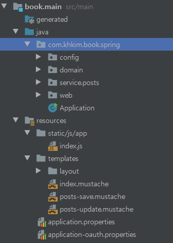

# Mustache 를 통한 화면 구성하기

## 템플릿엔진과 Mustache
템플릿 엔진이란? 

- 지정된 템플릿 양식(JSP, Freemarker, Mustache, React, Vue 등)과 데이터가 합쳐저 HTML 문서를 만들어 출력하는 포맷

이 책에서는 Mustache 를 다루며 아래의 장점을 가지고 있다

- 문법이 심플하다
- 로직 코드를 사용할 수 없어 View 의 역활과 서버의 역활을 명확하게 분리할 수 있다
- 클라이언트 / 서버 모두 지원한다

## Mustache 파일 생성

Spring boot 내의 Mustache 위치

## 진행순서
- bootstrap, jquery 사용

- 기본페이지 만들기
	- index.mustache 생성 
	- indexController 생성

-  게시글 등록화면 만들기
	- header, footer 추가
	- 글등록 버튼 추가 
	- 

## 질문
- Spring boot 에서 Front 관련 코드는 어디서 관리될까?
	- Spring boot 는 기본적으로 src/main/resources 에 위치하며 자동으로 인식된다
- index.js 에서 변수의 속성에 function 을 추가한 이유는?
	- 브라우저의 스코프는 공용공간이기 때문에 덮어쓰일 수 있다 (중복 회피)
- 페이지 로딩속도를 높이는 방법은?
	- css 는 header 에 js 는 footer 에 배치. HTML 의 로딩순서는 위에서부터 아래이다. 즉 js 의 용량이 클수록 실행이 느려지면 css 를 먼저 호출한다
- 레이아웃 방식이란?
	- 공통영역(header, footer, side) 를 별도의 파일로 분리하여 React 의 component 처럼 가져다 쓰는 방식
	

<!--stackedit_data:
eyJoaXN0b3J5IjpbLTE1NzUzNzk4OSwxNjY5MTUxOTMyLC0xMT
MzODExOTYxLDE5OTc1NDI5MjBdfQ==
-->